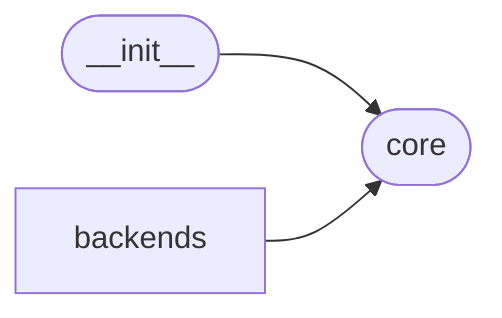

# Code Overview

[_Documentation generated by Documatic_](https://www.documatic.com)

<!---Documatic-section-Codebase Structure Python-start--->
## Codebase Structure Python

The codebase has a single-depth folder structure,
                with 8 code files in total.

<!---Documatic-block-system_architecture-start--->

<!---Documatic-block-system_architecture-end--->

# #
<!---Documatic-section-Codebase Structure Python-end--->

<!---Documatic-section-Key Objects-start--->
## Key Objects

There are exposed imports at level-0
from the source directory (proxmoxer)

<!---Documatic-block-proxmoxer-start--->

	
<code>proxmoxer</code> (Click to Expand!)

* `proxmoxer.core.ANYEVENT_HTTP_STATUS_CODES`
* `proxmoxer.core.ProxmoxAPI`
* `proxmoxer.core.ProxmoxResource`
* `proxmoxer.core.ResourceException`
* `proxmoxer.core.SERVICES`
* `proxmoxer.core.__author__`
* `proxmoxer.core.__copyright__`
* `proxmoxer.core.__license__`
* `proxmoxer.core.config_failure`
* `proxmoxer.core.logger`

<!---Documatic-block-proxmoxer-end--->

# #
<!---Documatic-section-Key Objects-end--->

<!---Documatic-section-Important Functions-start--->
## Important Functions

<!---Documatic-block-important_funcs-start--->
<!---Documatic-block-most_used_funcs-start--->
### Most Utilised Functions

* [proxmoxer.core.config_failure](3-proxmoxer_core.md#proxmoxer.core.config_failure) (2 times)
* proxmoxer.backends.command_base.shell_join (2 times)
* proxmoxer.core.__author__ (1 times)
* proxmoxer.core.__copyright__ (1 times)
* proxmoxer.core.__license__ (1 times)
* proxmoxer.core.logger (1 times)
<!---Documatic-block-most_used_funcs-end--->

<!---Documatic-block-end_user_funcs-start--->
### End User Exposed Functions

* proxmoxer.core.SERVICES
* proxmoxer.core.__author__
* proxmoxer.core.ResourceException
* proxmoxer.core.__copyright__
* proxmoxer.core.ANYEVENT_HTTP_STATUS_CODES
* proxmoxer.core.ProxmoxAPI
* [proxmoxer.core.config_failure](3-proxmoxer_core.md#proxmoxer.core.config_failure)
* proxmoxer.core.ProxmoxResource
* proxmoxer.core.logger
* proxmoxer.core.__license__
<!---Documatic-block-end_user_funcs-end--->
<!---Documatic-block-important_funcs-end--->

# #
<!---Documatic-section-Important Functions-end--->

<!---Documatic-section-File IO-start--->
## File IO

<!---Documatic-block-file_io-start--->
The following files have file write operations

<!---Documatic-block-proxmoxer.backends-start--->

	
<code>proxmoxer.backends</code> (Click to Expand!)

* proxmoxer.backends.local

<!---Documatic-block-proxmoxer.backends-end--->
<!---Documatic-block-file_io-end--->

# #
<!---Documatic-section-File IO-end--->

<!---Documatic-section-Class Hierarchy-start--->
## Class Hierarchy

<!---Documatic-block-CommandBaseSession-start--->

	
<code>CommandBaseSession</code> (Click to Expand!)

* proxmoxer.backends.local.LocalSession
* proxmoxer.backends.openssh.OpenSSHSession
* proxmoxer.backends.ssh_paramiko.SshParamikoSession

<!---Documatic-block-CommandBaseSession-end--->

<!---Documatic-block-object-start--->

	
<code>object</code> (Click to Expand!)

* proxmoxer.backends.command_base.CommandBaseBackend
* proxmoxer.core.ProxmoxResource

<!---Documatic-block-object-end--->

<!---Documatic-block-proxmoxer.backends.command_base.CommandBaseBackend-start--->

	
<code>proxmoxer.backends.command_base.CommandBaseBackend</code> (Click to Expand!)

* proxmoxer.backends.local.Backend
* proxmoxer.backends.openssh.Backend
* proxmoxer.backends.ssh_paramiko.Backend

<!---Documatic-block-proxmoxer.backends.command_base.CommandBaseBackend-end--->

<!---Documatic-block-proxmoxer.backends.https.ProxmoxHTTPAuthBase-start--->

	
<code>proxmoxer.backends.https.ProxmoxHTTPAuthBase</code> (Click to Expand!)

* proxmoxer.backends.https.ProxmoxHTTPApiTokenAuth
* proxmoxer.backends.https.ProxmoxHTTPAuth

<!---Documatic-block-proxmoxer.backends.https.ProxmoxHTTPAuthBase-end--->

<!---Documatic-block-proxmoxer.core.ProxmoxResource-start--->

	
<code>proxmoxer.core.ProxmoxResource</code> (Click to Expand!)

* proxmoxer.core.ProxmoxAPI

<!---Documatic-block-proxmoxer.core.ProxmoxResource-end--->

<!---Documatic-block-proxmoxer.core.ResourceException-start--->

	
<code>proxmoxer.core.ResourceException</code> (Click to Expand!)

* proxmoxer.core.ResourceException

<!---Documatic-block-proxmoxer.core.ResourceException-end--->

# #
<!---Documatic-section-Class Hierarchy-end--->

[_Documentation generated by Documatic_](https://www.documatic.com)