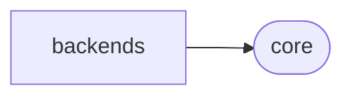

# Proxmoxer Backends

[_Documentation generated by Documatic_](https://www.documatic.com)

<!---Documatic-section-Codebase Structure-start--->
## Codebase Structure

<!---Documatic-block-system_architecture-start--->

<!---Documatic-block-system_architecture-end--->

# #
<!---Documatic-section-Codebase Structure-end--->

<!---Documatic-section-proxmoxer.backends.https.is_file-start--->
## [proxmoxer.backends.https.is_file](4-proxmoxer_backends.md#proxmoxer.backends.https.is_file)

<!---Documatic-section-is_file-start--->
<!---Documatic-block-proxmoxer.backends.https.is_file-start--->
<details>
	<summary><code>proxmoxer.backends.https.is_file</code> code snippet</summary>

```python
def is_file(obj):
    return isinstance(obj, io.IOBase)
```
</details>
<!---Documatic-block-proxmoxer.backends.https.is_file-end--->
<!---Documatic-section-is_file-end--->

# #
<!---Documatic-section-proxmoxer.backends.https.is_file-end--->

<!---Documatic-section-proxmoxer.backends.https.get_time-start--->
## [proxmoxer.backends.https.get_time](4-proxmoxer_backends.md#proxmoxer.backends.https.get_time)

<!---Documatic-section-get_time-start--->
<!---Documatic-block-proxmoxer.backends.https.get_time-start--->
<details>
	<summary><code>proxmoxer.backends.https.get_time</code> code snippet</summary>

```python
def get_time():
    return time.monotonic()
```
</details>
<!---Documatic-block-proxmoxer.backends.https.get_time-end--->
<!---Documatic-section-get_time-end--->

# #
<!---Documatic-section-proxmoxer.backends.https.get_time-end--->

<!---Documatic-section-proxmoxer.backends.https.get_file_size-start--->
## [proxmoxer.backends.https.get_file_size](4-proxmoxer_backends.md#proxmoxer.backends.https.get_file_size)

<!---Documatic-section-get_file_size-start--->
<!---Documatic-block-proxmoxer.backends.https.get_file_size-start--->
<details>
	<summary><code>proxmoxer.backends.https.get_file_size</code> code snippet</summary>

```python
def get_file_size(file_obj):
    starting_cursor = file_obj.tell()
    file_obj.seek(0, os.SEEK_END)
    size = file_obj.tell()
    file_obj.seek(starting_cursor)
    return size
```
</details>
<!---Documatic-block-proxmoxer.backends.https.get_file_size-end--->
<!---Documatic-section-get_file_size-end--->

# #
<!---Documatic-section-proxmoxer.backends.https.get_file_size-end--->

<!---Documatic-section-proxmoxer.backends.https.get_file_size_partial-start--->
## [proxmoxer.backends.https.get_file_size_partial](4-proxmoxer_backends.md#proxmoxer.backends.https.get_file_size_partial)

<!---Documatic-section-get_file_size_partial-start--->
<!---Documatic-block-proxmoxer.backends.https.get_file_size_partial-start--->
<details>
	<summary><code>proxmoxer.backends.https.get_file_size_partial</code> code snippet</summary>

```python
def get_file_size_partial(file_obj):
    starting_cursor = file_obj.tell()
    file_obj.seek(0, os.SEEK_END)
    size = file_obj.tell() - starting_cursor
    file_obj.seek(starting_cursor)
    return size
```
</details>
<!---Documatic-block-proxmoxer.backends.https.get_file_size_partial-end--->
<!---Documatic-section-get_file_size_partial-end--->

# #
<!---Documatic-section-proxmoxer.backends.https.get_file_size_partial-end--->

[_Documentation generated by Documatic_](https://www.documatic.com)